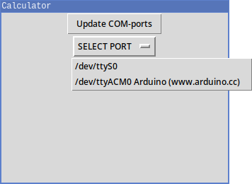
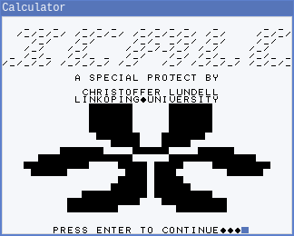

# Calculator Screen

 

## Description
A platform independent bitmap-based serial terminal that supports the
communication protocol for the ICALC project, with a simple graphical interface
for setting the serial port.

## Installation
The program requires:

- `pySerial` to connect to serial devices.
- `TKinter` to handle the graphical interface.

Both libraries may be installed by `pip install pyserial tk`.

The program also expects...

- ... to have full access to serial ports.

- ... that there exists a file called `charset.vhdl` to read from in the parent
  directory.

## Usage
Run the file `calculator_screen.py`

## Why
- To have a handier terminal for the ICALC project than hooking up a VHDL
  device with a custom converter.

- To test changes to the characters and learn about pixel based graphical
  drawing.

- To not have to differentiate between SPI output and UART output in the ICALC
  project.

- Easier to use than many serial terminals out there!

- Because it is fun.

## Troubleshooting
Run the program in a terminal for error messages.
